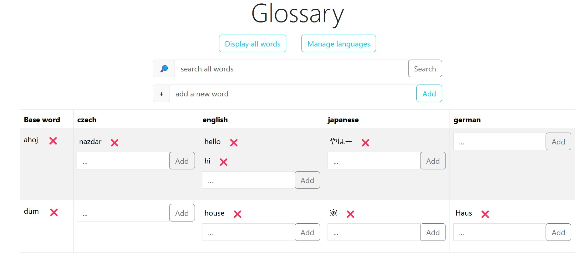
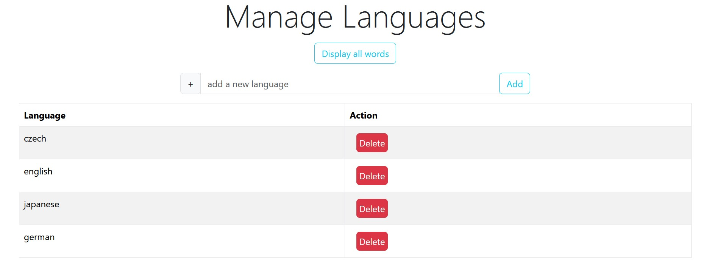

**Simple glossary app that supports dynamic number of languages and dynamic number of translations for each term.**

Created with Spring Boot and MySQL database, front-end GUI created with Thymeleaf.

Extremely simple controls: just add any languages you use, and then keep adding new terms and translations for those languages.

Search bar looks for any text (or parts of words) in all the terms and translations.

